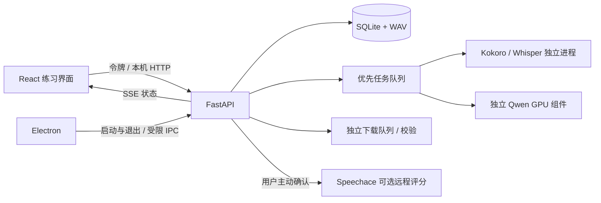

# 实现结构

Electron 是桌面生命周期与系统权限边界；React 负责练习交互；FastAPI 管理数据与任务。
模型不在 HTTP 请求线程内推理，避免生成语音时阻塞界面和取消请求。

## 可以从这里阅读源码

| 文件 | 职责 |
|---|---|
| `electron/main.cjs`、`preload.cjs` | 本机随机端口与令牌、沙箱、麦克风权限、文件保存、进程退出 |
| `src/App.tsx` | 双语练习、编辑、播放、录音、反馈、模型与服务配置 |
| `backend/speech_practice/app.py` | API、输入限制、鉴权、实际文件与 Range 下载 |
| `storage.py` | 会话、句子版本、历史与进度 |
| `jobs.py`、`worker.py` | 排队、优先级、缓存、取消、推理进程复用与隔离 |
| `providers.py` | 三种本地模型的真实推理适配 |
| `text.py` | 分句、带原始位置的规范化与词级编辑距离对齐 |
| `audio.py` | 音频解码、24kHz 单声道 PCM16、重采样与整篇合并 |
| `models.py`、`components.py` | 固定版本模型下载、恢复、哈希校验、安全导入 |
| `pronunciation.py` | Windows 凭据管理器、Speechace v9、缺失字段与时间单位解析 |

## 三个关键不变量

1. **录音引用的是当时的稿件。** 句子修改产生新版本，已保存录音保留旧文本与版本。
   因此历史反馈不会被新稿件重新解释。当前练习卡片展示的是保存后的朗读稿。
2. **缓存包含所有影响语音的输入。** 文本、供应商、声线、参数和固定模型版本共同参与哈希；
   句子编辑会清除当前音频引用，旧缓存仍能在恢复相同参数时复用。
3. **识别差异与发音评分独立。** 编辑距离比较目标词与识别词，只能提示可能的内容变化；
   识别概率没有经过校准，不能作为发音准确率。音素分数只来自显式调用的 Speechace。

## 调度与恢复

同一推理队列串行工作。整篇任务每完成一句重新入队，让用户新提交的当前句优先运行。
模型下载使用另一条串行队列，不占用已有模型的推理槽位。取消当前推理会结束 worker；
下一次请求重新启动，完成的 WAV 与缓存保留。重启时未完成任务标为失败，用户可重试。
未知生成剩余时间只显示阶段；下载进度来自已接收字节，整篇进度来自已完成句数。

## 构建边界

基础包打包 CPU Python 运行时；高模式包独立打包 PyTorch/CUDA 与 Qwen 依赖。
两个环境分别使用 `uv.lock` 和 `requirements-qwen.lock`；前端使用 `package-lock.json`。
用户无需安装开发运行时。模型权重不在安装包里，版本及哈希在 `model_manifest.json`。
实际测试范围、运行证据与尚未验证的事项见 `VALIDATION.md`。

## 0.2 additions

`feedback.py` owns score provenance, documented scale validation, issue priority rules and non-destructive historical views. `observations.py` owns 16kHz mono preparation and unscored local measurements. `cloud.py` implements independent Tencent ASR and new SOE adapters; credential input validation never echoes secrets. `contracts.py` declares adapter capabilities and limits. Speechace remains behind PronunciationProvider. New assessments are embedded in `assessment_history`; ASR results append to `recognition_history`, retaining the recording's original reference revision. No destructive SQLite migration is needed.

`WhisperProvider` accepts CPU/int8 or CUDA/float16 and a local pinned CT2 directory. GPU requests use the same optional runtime and serial queue as Qwen. Component capability `gpu-asr` prevents silently invoking an old 0.1 GPU runtime for ASR. The worker cache key includes model directory and device, and switching providers releases the previous model.

`src/FeedbackPanel.tsx` renders available/unavailable scores, provider source, history, bounded issues and a timeline. `segment.ts` calculates context independently of original evidence. `ProviderSettings.tsx` keeps ASR and assessment choices independent. Tests verify these boundaries; performance and human validity remain separate evidence in ITERATION_0.2.md.
