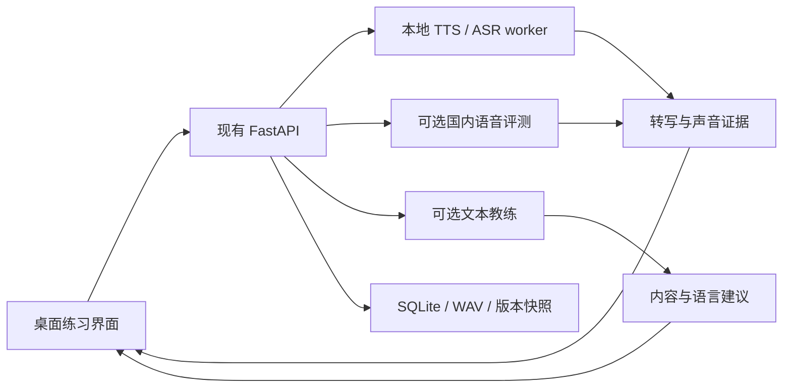

# speech-practice 迭代规划技术报告

报告日期：2026-10-04（北京时间）；资料核查于 2026-10-03 至 10-04 完成。  
状态：待用户审阅的规划草案  
目标平台：Windows 11 x64；服务对象：中国用户，兼顾雅思与 TOEFL iBT 口语备考。

本报告根据本轮代码阅读、既有验收记录和官方资料调查编写。此次只新增报告，没有运行模型比较、付费 API、重新执行验收或修改应用实现。下面的发布门槛属于建议标准，已有测试结果单独注明来源。

## 1. 推荐决策

1. **下一轮只做现有功能稳定性验收。** 先让安装、模型准备、示范、录音、识别、回放、保存和恢复可靠，再增加能力。
2. **本地优先，国内云端增强。** 普通电脑完成基础练习；用户需要更细的纠音或语言指导时，主动选择在线服务。
3. **每轮只发布一个用户可独立理解的新能力。** 配套的数据结构、设置、错误处理和测试随该能力交付；其他功能进入下一轮。
4. **先补识别与纠音基础，再做备考训练。** 备考功能优先形成“限时回答—复盘—再答”的闭环，随后加入听后复述、追问与个人弱项练习。
5. **保持现有技术栈。** 继续使用 Electron、React、TypeScript、FastAPI、SQLite 与已有 worker；按功能增加小模块，不提前搭建通用智能体平台。

先前将模型升级、多个 API、五维评分、时间轴和考试训练放进同一轮的方案，在本报告中拆分为独立发布。完整路线见第 6 节。

## 2. 当前代码与证据基线

### 2.1 已有能力

| 能力 | 当前实现 | 本轮阅读位置 |
|---|---|---|
| 示范朗读 | Kokoro CPU；独立 Qwen3-TTS GPU 组件 | `backend/speech_practice/providers.py`、`worker.py` |
| 英文识别 | faster-whisper `small.en`，CPU/int8，6 线程，beam=5，英文、VAD、词时间戳 | `providers.py` |
| 内容差异 | 规范化与词级编辑距离；识别不确定时不生成差异列表 | `text.py`、`jobs.py` |
| 录音 | MediaRecorder 上传，后端解码为 24kHz 单声道 WAV | `src/App.tsx`、`audio.py`、`app.py` |
| 发音评测 | Speechace v9；词／音素分数、音素时间、部分中文模板 | `pronunciation.py` |
| 局部回放 | 已有 `playSegment(start, end)`，按播放进度停止 | `src/App.tsx` |
| 持久化 | SQLite `objects(id, kind, body)`；JSON 保存会话、录音、反馈与任务 | `storage.py` |
| 分发 | NSIS 基础包，独立高模式运行组件 | `package.json`、`packaging`、`scripts` |

现有录音挂在句子下面；内容分析默认把该句朗读稿作为目标。无稿回答需要新增练习类型和录音上下文，不能简单填入一篇范文后沿用差异判断。

### 2.2 已有验收记录的意义

[既有验收记录](./VALIDATION.md)报告：17 项后端测试、2 项浏览器测试通过，并保存了真实模型、冻结后端、桌面和长文流程证据。此次没有重跑这些测试。

既有测试机为 Core Ultra 9 275HX、32GB 内存、RTX 5060 Laptop 8GB。其模型结果能证明开发机流程可运行；普通 CPU 电脑、真人口音、干净 Windows 环境仍需补测。现有 ASR 基准部分使用 TTS 音频，不能直接代表目标用户识别效果。

### 2.3 下一轮优先复现的边界

| 边界 | 阅读发现 | 验证方式 |
|---|---|---|
| 录音与稿件版本 | 前端录音前保存句子；上传只传句子 ID，后端在上传开始时读取版本 | 当前 UI 大多禁用录音时编辑；另测试并发 API／多窗口修改，确认归属录音开始时的文本 |
| 录音时长 | 前端在 119 秒停止，后端限制 120 秒 | 先验证当前边界；限时回答上线时参数化，测试计时、编码尾帧与后端上限配合 |
| 片段停止状态 | `stopAt` 与当前播放器关联 | 片段播放中切换历史、正常播放、拖动进度、连续点击，确认旧停止点不会影响新播放 |
| 模型与设备选择 | Whisper 的模型目录和 CPU 参数目前固定 | 识别增强轮增加配置与 worker 加载标识，验证模型切换后确实更换推理实例 |
| 在线服务路由 | `jobs.py` 直接实例化 Speechace；API 层也写死 30 秒限制 | 国内评测轮改为按 provider 能力分派，并保留旧调用兼容 |

这些是静态阅读发现的测试重点；是否构成实际缺陷，由复现结果决定。

## 3. 考试需求与产品功能对应

### 3.1 雅思

雅思口语的发音、流利度与连贯性、词汇、语法四项等权。跟读主要服务声音表达，题目回答和复盘扩展到观点组织与语言运用。[官方评分说明](https://ielts.org/news-and-insights/demystifying-the-ielts-speaking-test)

Part 2 提供一分钟准备，随后讲话一至两分钟。因此建议先做题卡、准备计时、回答计时和录音回听，之后再增加回答复盘。[官方考试格式](https://ielts.org/take-a-test/test-types/ielts-academic-test/ielts-academic-format-speaking)

### 3.2 当前 TOEFL iBT

按 2026 版设计：口语包含 Listen and Repeat 与 Take an Interview，分别训练听后复述和围绕经历、观点的即时回答。[ETS 当前题型](https://www.ets.org/toefl/test-takers/ibt/about/content/speaking.html)

当前规格列出 7 道复述、4 道采访题，口语约 8 分钟；应保存题型版本，后续考试更新只修改配置。[ETS 2026 规格](https://www.ets.org/pdfs/toefl/toefl-ibt-test-specifications-2026.pdf)

官方练习说明中，这两种任务均没有准备时间，复述要求只重复一次。训练模式可提供重试，考试练习模式按这些规则执行。此次没有确认各题具体作答秒数，开发时补查官方交互练习，不把旧版托福计时套入新版。[ETS 官方练习](https://www.ets.org/pdfs/toefl/toefl-ibt-full-length-practice-test-1.pdf)

### 3.3 为什么优先做回答闭环

用户收益判断如下：跟读建立发音与节奏基础；限时回答训练提取语言和组织观点；复盘给出下一次能执行的改进；同题重答让用户立即运用建议。内容切题、展开、语言运用和清晰表达也对应托福采访评分关注点。[ETS 口语评分标准](https://www.ets.org/pdfs/toefl/speaking-rubrics.pdf)

这些功能的优先级是本项目的产品判断，不是提分效果的实测结论。早期用户验证关注“反馈是否帮助下一次回答”，无需先建立考试分数预测模型。

## 4. 本地能力调查与选择

### 4.1 模型候选

| 模型 | 角色 | 首次比较重点 |
|---|---|---|
| 当前 `small.en` | CPU 基线与低资源选项 | 真人转写、差异误报、响应时间 |
| Distil-Whisper large-v3.5 | 优先增强候选 | 中国用户英文短句、CPU/int8 和可选 GPU、词时间定位 |
| Whisper large-v3-turbo | 对照候选 | 同条件识别收益与资源成本 |

Distil-large-v3.5 的模型卡提供 faster-whisper 接入方法；turbo 的模型卡提供其模型定位。两者都可进入验证，但最终默认选择由本项目数据决定。[Distil 模型卡](https://huggingface.co/distil-whisper/distil-large-v3.5)、[Turbo 模型卡](https://huggingface.co/openai/whisper-large-v3-turbo)

继续使用 CTranslate2 推理路径。CPU 包保持轻量；GPU 路径需要额外运行库验证。faster-whisper 官方文档列明当前 GPU 路径需要 CUDA 12 对应的 cuBLAS 与 cuDNN 9，不能仅检查显卡存在就认为安装包可运行。[运行依赖](https://github.com/SYSTRAN/faster-whisper)

### 4.2 比较方法

1. 所有模型使用相同录音和文本规范化，记录完整参数与模型 revision。
2. 每条录音分别保存“目标稿件”和“人工听写内容”：模型转写质量对比人工听写，练习内容差异对比目标稿件。
3. 第一批建议 30 条真人样本、至少 3 名说话人，覆盖正确朗读、漏词／替换／重复、发音变化、轻声与噪声；后续扩大到 100 条。
4. 参数调整集与验收集按说话人或材料分开，避免专门调到某几句表现良好。
5. 测量 WER、正确朗读误报数、实际内容变化检出数、不确定结果比例、冷／热耗时、RTF 与峰值资源。
6. 声学异常先检查采样率、声道、音量、削波、截断和 VAD，再判断是否需要换模型。

WER 按总词数计算：`(替换 + 删除 + 插入) / 人工转写词数`；不将它称为发音分。重复词、数字和缩写单独检查。

### 4.3 选择门槛

以下是初始产品目标，R0 得到真人基线后可调整并记录理由：

- 增强候选在留出的真人样本上，整体 WER 相对基线下降约 15% 或以上，且正确朗读误报不增加。
- 普通 CPU 设备轻量档热运行目标 RTF ≤ 1.5；增强档允许更慢，但必须展示实测代价并允许切回轻量档。
- 短录音识别期间界面仍可操作，任务可取消，已有数据不丢失。
- 不确定率与误报一起报告，避免通过全部拒绝识别获得低误报。
- 若候选没有稳定收益，保留基线；发布已验证的音频链路和参数改进，不硬推新权重。

模型下载继续复用清单、断点恢复、手动导入和校验。国内分发优先选择合法可信的可访问来源，保留上游版本、许可和哈希。个人电脑无需安装开发环境；模型准备后基础流程可断网运行。

## 5. 国内服务调查与接入决策

### 5.1 语音评测

| 服务商 | 已确认能力 | 建议位置 |
|---|---|---|
| 腾讯云口语评测新版 | 英文句子发音／流利度／完整度、词与音素反馈；另有自由说模式 | 第一家上线 |
| 科大讯飞流式评测 | 英文词、句、篇章评测；分项、分层时间、可选扩展信息 | 第二家对照候选 |
| 先声智能 | 句子评分与逐词反馈，单词模式有音素反馈 | 后续专业候选 |
| Speechace | 现有适配与历史结果 | 保留兼容 |

腾讯云英文句子模式限 30 词、60 秒；自由说无需参考文本、音频最长 300 秒，维度与句子模式不同。R2 先接入句子模式；无稿训练稳定后，再为自由说配置相应评测。[腾讯模式说明](https://cloud.tencent.com/document/product/1774/107373)

讯飞使用 WebSocket，结果需按实际协议解码；英文参数、题型和扩展能力共同决定返回内容。[讯飞现行接口](https://www.xfyun.cn/doc/Ise/IseAPI.html)

先声的句子与单词引擎分别有公开契约，应按所选引擎确认分项与定位字段。[句子引擎](https://open.singsound.com/doc/engine?detail=false&type=engine-en-en.sent.score)、[单词引擎](https://open.singsound.com/doc/engine?type=engine-en-en.word.score)

国内 API 的账号、地域、权限和真实录音效果在接入轮验证。只上线一家已跑通的默认候选，不同时制作多家配置向导。

### 5.2 ASR 与文本教练

腾讯云录音文件识别提供英文模型和词级结果；阿里云也提供支持英文的 Fun-ASR、Qwen-ASR 等。作为本地增强不足时的后续可选 ASR，不与第一轮国内纠音一起扩张。[腾讯 ASR](https://cloud.tencent.com/document/api/1093/52097)、[阿里云 ASR](https://help.aliyun.com/zh/model-studio/asr-model/)

回答复盘采用独立 `LanguageCoachProvider`：输入题目与用户确认的转写，输出内容、语法、词汇建议。优先评估百炼支持结构化输出的 Flash 模型，DeepSeek 为对照候选；首次只上线一家。JSON 模式仍需应用层校验字段、原文引用和范围。[百炼结构化输出](https://help.aliyun.com/zh/model-studio/qwen-structured-output)、[DeepSeek JSON 模式](https://api-docs.deepseek.com/guides/json_mode/)

文字教练评价用户说出的内容；音素和声学问题继续由语音评测提供。LLM 不输出自行猜测的音频时间范围。

### 5.3 成本与用户接入

截至本报告查询日，腾讯评测公开价格为后付费 0.005 元／计费次，另有一年有效、限购一个的 9.9 元／1 万次套餐。段落和自由说按每 20 词折算次数。[官方计费](https://cloud.tencent.com/document/product/1774/107342)

预算示例：1,000 个计费次后付费为 5 元；120 词段落按该规则约 6 次、0.03 元。自由说实际计量字段在接入时结合账单核实。重试、并发资源和其他服务费用另按实际配置计算。这是规则估算，不是已经发生的账单。

文本复盘预算使用公式：`输入 token × 输入单价 + 输出 token × 输出单价`。实现时冻结模型快照和部署地域，按实际 usage 记录费用；价格从官方页面获取，初始单次复盘成本目标可设为 ≤0.05 元。[百炼模型价格](https://help.aliyun.com/zh/model-studio/model-pricing)

初期沿用用户自带密钥。设置清楚区分“语音识别”“发音评测”“回答复盘”，调用前显示上传对象；用户授权范围内执行，不因失败自动换到其他付费服务。密钥放入现有凭据存储，由后端鉴权。

让普通用户免配置，需要独立的国内服务端代理、配额和费用管理。等免费本地与 BYOK 版本有稳定用户反馈后，再单独规划该服务。

## 6. 每轮一个功能的发布路线

工作量 S/M/L 表示相对复杂度；实际工期依赖真人样本、测试设备和 API 权限，不预先给出固定上线日期。

| 轮次 | 唯一发布目标 | 用户得到什么 | 本轮范围 | 工作量 |
|---|---|---|---|---|
| R0 | 现有版稳定性验收 | 现有练习闭环可靠 | 测试、复现、必要修复与安装包验证 | M |
| R1 | 本地识别增强 | 更可信的转写与内容差异 | 音频链路、候选比较、一个增强选项、模型配置 | M–L |
| R2 | 国内发音评测 | 可以使用腾讯云英文评测 | 单一服务适配、密钥、限制与现有词／音素展示 | M |
| R3 | 纠音问题定位 | 看到重点问题并点击回听 | 问题标准化、最多 10 条建议、时间轴与上下文回放 | M |
| R4 | 限时无稿回答 | 按题目与计时直接说英语 | 题卡、计时、录音、转写、历史 | M |
| R5 | 回答复盘与重答 | 得到三条重点建议并再答一次 | 一个文本教练、用户确认转写、提纲、两次回答对比 | M–L |
| R6 | 听后复述 | 听一句后凭记忆说出 | 隐藏文本、示范、一次作答、完成后差异反馈 | M |
| R7 | 模拟考官追问 | 围绕自己的回答继续展开 | 受控追问、有限轮次、题目与录音关联 | M |
| R8 | 个人弱项练习 | 每天练反复出现的问题 | 个人问题聚合、选择任务、练习记录 | M |

R1–R3 完善基础质量；R4–R6 是备考核心。R7、R8 的顺序可根据已上线功能的使用情况调整。新增第二家评测、国内云端 ASR、服务端代理各作为独立后续轮次，不插入当前发布包。

“每轮一个功能”按用户目标划分：R2 的密钥设置是调用评测的配套工作；R5 的重答是完成一次复盘训练的后半程。完整模拟考试、开放聊天和自动生成整套课程属于另外的能力。

## 7. 各轮实现与验收

### R0：稳定现有版

执行现有后端、前端、桌面与冻结包检查；按第 2.3 节新增有必要的边界测试。用独立数据目录测试，不占用正在使用的会话或替换主进程构建产物。

人工矩阵至少覆盖：干净 Windows 11 安装、普通 CPU 电脑、真人麦克风、拒绝权限、无设备、静音、中文路径、120 秒边界、保存文件、重启恢复、退出清理及模型准备后的物理断网。高模式只在已测试设备范围验收。

完成标准：阻断练习、数据丢失、退出残留与结果关联错误全部修复；正常流程没有未解决的主要问题；其他问题带复现步骤记录。已有自动测试数量不作为发布质量的唯一依据。

### R1：本地识别增强

模型选择进入请求快照，反馈保存模型 ID、revision、设备和参数。worker 的复用标识包含模型与计算配置，避免 UI 选了新模型却继续使用旧实例。

验收使用第 4 节真人集；安装包实际加载所选模型；失败后可以切回轻量模式；取消与重启保留录音。GPU 若未完成打包验证，先交付 CPU 路径，不阻塞 CPU 改进。

### R2：国内发音评测

先接腾讯云句子模式，继续使用现有词／音素列表与播放能力。新增 `provider` 选择和能力描述；把写死的供应商与时长检查迁移到对应适配器。

供应商分别转换采样率、格式和时间单位，保留原始录音。句子超过文本或时长限制时提示拆分。解析器区分有效结果、无效特殊值、未配置、权限不足、请求失败和不可评估录音。

验收：真实录音调用、词／音素反馈、时间范围、保存与重启；官方样例只用于解析测试。缺少密钥时可完成实现与样例测试，但该在线功能保持待验收，不把它计为已上线。

### R3：纠音问题定位

在供应商证据上增加应用问题列表：词／音素异常、支持的重音问题等。严重程度表示练习优先级。最多展示 10 个问题，允许没有问题；同一处词级与音素级重复反馈合理合并。

优先使用 provider 时间；ASR 补充词级定位时标明粒度。未知时间为 null；有效时间满足 `0 ≤ start < end ≤ duration`。上下文播放增加约 200–300ms，原始证据范围保持不变。

验收：人工检查至少 20 个问题，统计证据一致性、定位偏差及是否包含目标声音；连续点击、切换录音与手动拖动播放正确。初始目标：可定位问题中至少 90% 的上下文片段包含目标声音，报告具体样本数。

### R4：限时无稿回答

新增 `PracticeSession/Attempt`，不要求创建参考朗读稿。先提供雅思 Part 2 原创题卡与可配置的短问答计时；题卡带考试、题型和规则版本。TTS 读题复用现有能力。

流程：选题 → 按规则准备 → 回答 → 停止并保存 → 回听／转写。无稿回答只展示转写和观察，不与范文进行漏词、替换判断。

计时改为基于单调时间的截止点，不靠 interval 次数累加；明确切后台、休眠、权限等待与提前结束行为。录音长度与上传解码容差配套设计，先完整覆盖最长两分钟回答。

验收：一分钟准备、最长两分钟回答、多次重录和恢复历史；权限等待不吃掉作答时间；结束后录音可保存；不产生范文差异错误。首批题目全部为原创或用户自有材料。

### R5：回答复盘与重答

用户确认转写后提交题目与回答。文本教练每次给出最多三条重点建议，覆盖内容、语法、词汇，引用原文并给出具体修改或补充动作。随后给短提纲，允许按自己的观点重答，不强制背诵范文。

语音反馈单独展示；自由说评测通过腾讯相应模式使用，不把范文或完整目标答案作为参考稿。该模式只能展示其实际支持的维度。[自由说接口说明](https://cloud.tencent.com/document/product/1774/107389)

缓存按题目版本、确认转写版本、教练模型和提示词版本确定。编辑转写生成新版本，不覆盖原始 ASR。旧文本位置不能直接映射到新转写的声音；需要原转写映射或重新对齐。

验收：20 份原创测试回答，覆盖跑题、缺少例子、语法错误、正确但朴素的表达、ASR 误识别及不完整输出。建议必须引用真实内容、可执行并保持用户原意；初始目标至少 16 份得到人工认可的有效重点建议。两次回答独立保存，用户可并排回听。

### R6：听后复述

复用 TTS、录音和有稿对齐：生成示范 → 隐藏目标文本 → 播放 → 用户复述 → 保存后揭示原文与反馈。训练模式允许重试；按新版托福规则的练习模式不给准备时间、示范一次并作答一次。

完成前不通过界面、字幕或播放器标签泄露目标文本。听力速度是播放策略；不同速度与文本配置进入任务快照。难度首先按句长、结构和语速分级。

验收：目标文本隐藏、示范播放结束再开始作答计时、录音与目标匹配、重复词定位、训练重试与考试练习规则。自编练习材料使用本地 TTS，另留少量合法真人示范检验不同声音的适应情况。

### R7：模拟考官追问

在限时回答上增加最多三轮追问，可选择原因、例子、比较和反面情况。先预定义规则，文本模型用于形成自然问题；网络失败时使用题卡自带追问。

验收追问与上一回答相关、不会重复同一问题、可以停止、所有问题与录音可回溯。完整口语模考的考试时长与评分另行规划。

### R8：个人弱项练习

按多次记录聚合问题，用重复出现次数和最近练习选择重点；保留来源录音、建议和用户确认。练习卡先包含少量词／句、一个复述或一道回答，目标约十分钟。

验收问题能回到原始证据；单次可疑识别不会成为长期弱项；用户可忽略、修正、删除；先给清楚的历史和练习安排，再考虑复杂自适应算法。

## 8. 数据与模块边界

逐轮引入对象，沿用 SQLite JSON 对象存储，无需先迁移 ORM：

| 对象 | 最早引入 | 核心字段 |
|---|---|---|
| ModelProfile | R1 | model_id、revision、device、compute_type、parameters |
| AssessmentFeedback | R2 | schema_version、provider、status、scores、raw_result、error |
| PracticeIssue | R3 | category、severity、evidence、start/end、time_source、granularity、advice |
| Prompt / PracticeSession | R4 | exam、task_type、rule_version、topic、timing、mode |
| Attempt | R4 | recording_id、prompt_snapshot、attempt_number、transcript_versions |
| AnswerReview | R5 | confirmed_transcript_version、coach_model、prompt_version、issues、outline |
| Followup | R7 | parent_attempt_id、question、strategy |
| WeaknessItem | R8 | issue_refs、occurrences、last_practiced、user_state |

有稿／无稿分别路由：`reading/repeat` 可以做目标文本差异；`answer/interview` 只转写与复盘。共用录音、音频资产、任务状态和播放器。

分项分数保存 value、status、source_field、scale 与转换方法。问题证据保存字段路径、词序／音素、原始分数、规则版本。语音问题与文本问题分别建模，UI 可以汇总展示。

五维综合总分暂不作为本路线的发布目标。优先展示有明确定义的供应商分项、练习观察和具体建议，完整度、标准度等保留原名。

新增模块建议为 provider registry、practice sessions、answer review 和 issue normalization，按对应轮次加入。`src/App.tsx` 新功能过大时局部提取练习组件，不同时重写已有页面。

## 9. 每轮发布门槛

每轮都执行“实现 → 针对性测试 → 安装包验收 → 小范围试用 → 修复 → 发布”。正在开发的独立功能可以暂不进入正式界面；数据升级保留旧记录，发布前用旧数据副本验证。

共同必验项：

- 现有核心路径回归，新增功能成功、失败与取消路径通过。
- 安装后的应用可运行，不依赖开发机外部 Python／Node。
- 录音、文本、反馈的版本和归属正确。
- 网络失败不影响本地练习；云端任务不阻塞播放和保存。
- 支付服务没有未授权调用或隐式跨供应商重试。
- 日志可定位错误，但不输出密钥；用户材料作为数据处理，不执行其中的指令。
- UI 遵守仓库 AGENTS.md：功能名称、状态、按钮和结果说明直接准确。
- 所有未完成项在发布记录中明确分类，不以规划内容充当实现结果。

每轮报告固定包含：版本与构建标识、唯一新增功能、设备与依赖、测试步骤和结果、真人／真实 API 证据、已知问题、安装包文件与校验值、下一轮候选。

## 10. 用户试用与成功指标

邀请 3–5 位目标用户完成真实任务，先观察是否独立完成，再收集意见。人数是早期发现问题的工作规模，不用于推断全体用户效果。

| 阶段 | 主要观察 |
|---|---|
| R0–R1 | 能否安装和准备模型；是否能完成练习；识别误报是否令人困惑 |
| R2–R3 | 能否配置服务；问题定位是否方便；建议是否具体到下一步动作 |
| R4–R5 | 能否持续完成回答；反馈是否被实际采用；二次回答是否更完整清楚 |
| R6 | 难度是否合适；复述反馈能否指出需要重新练的部分 |
| R7–R8 | 追问是否自然；弱项安排是否比随机练习更有方向 |

先从本地日志和用户主动提交的试用记录获得这些数据，不在本路线中增加自动上传录音、账号或云同步。可记录匿名的操作次数与耗时到本地，是否共享由用户决定。

## 11. 审阅时需要敲定的事项

- [ ] 接受 R0 先稳定、R1–R3 补基础、R4–R6 做备考核心的顺序。
- [ ] 初期继续 BYOK，服务端代理另行规划。
- [ ] 第一家国内评测选择腾讯云，讯飞保留对照候选。
- [ ] 首个无稿任务以雅思 Part 2 为主，短问答规则保持可配置。
- [ ] 题目使用原创／用户自有材料；正式考试品牌与题型说明保持准确。
- [ ] 确定首批真人样本、普通 CPU 测试机和干净 Windows 测试环境的获取方式。

这些选择不需要全部完成后才开始 R0。现有功能验证与问题复现可以先推进，模型、供应商和题型选择在对应轮次冻结。

## 12. 可交给主进程的下一轮指令

> 本轮只执行 R0：验证并稳定现有 speech-practice。沿用当前技术栈、TTS、ASR、录音与存储。先检查最新代码、测试和已有验收证据，复现版本快照、录音时长与片段播放边界，完成现有闭环的真人、安装包和离线测试。修复已复现的问题，保留用户数据。新增测试仅覆盖实际缺陷与重要行为。产出稳定性报告、已知问题与可复现验收记录；本轮不顺带接入新供应商、升级模型或开发考试训练。后续每轮按本报告只选择一个发布目标。

报告结论：先建立可靠的本地练习基础，再逐轮增加国内纠音、限时回答、复盘重答和听后复述。每一次发布都给用户一个能独立使用、经过安装包验证的能力。
